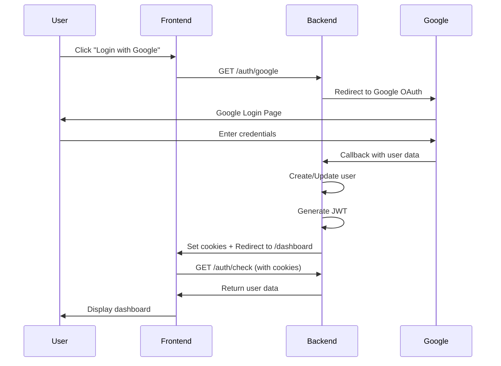

# 🔒 Guide Complet - Authentification Sécurisée (Frontend + Backend)

## ✅ Modifications Complètes

L'authentification a été **entièrement sécurisée** en utilisant des **cookies httpOnly** au lieu de passer les données dans les paramètres d'URL.

---

## 🎯 Problème Résolu

### ❌ Avant (Insécure)
```
URL après login: /dashboard?user=%7B%22email%22%3A%22user%40example.com%22%2C%22token%22%3A%22eyJhbGc...

Problèmes:
- Token JWT visible dans l'URL
- Données utilisateur exposées
- Historique du navigateur compromis
- Logs serveur contiennent les tokens
- Vulnérable aux attaques XSS
```

### ✅ Maintenant (Sécurisé)
```
URL après login: /dashboard

Avantages:
- URL propre et professionnelle
- Token JWT dans cookie httpOnly (invisible au JavaScript)
- Protection contre XSS
- Protection CSRF avec sameSite
- Historique et logs propres
- Conforme aux standards de sécurité web
```

---

## 📦 Installation

### 1. Backend

```bash
cd backend

# Installer les dépendances (dont cookie-parser)
npm install

# Démarrer le backend
npm run start:dev
```

Le backend sera accessible sur `http://localhost:3000`

### 2. Frontend

```bash
cd frontend

# Installer les dépendances
npm install

# Démarrer le frontend
npm run dev
```

Le frontend sera accessible sur `http://localhost:3001`

---

## 🧪 Test Complet

### Test 1: Authentification Google

1. **Ouvrir le navigateur**
   ```
   http://localhost:3001/login
   ```

2. **Cliquer sur "Continue with Google"**
   - Vous serez redirigé vers Google OAuth
   - Sélectionner un compte Google
   - Autoriser l'application

3. **Vérifier la redirection**
   ```
   ✅ URL: http://localhost:3001/dashboard
   ❌ PAS: /dashboard?user=...
   ```

4. **Vérifier les cookies (DevTools)**
   - Ouvrir DevTools (F12)
   - Aller dans "Application" > "Cookies" > "http://localhost:3001"
   - Vérifier la présence de :
     - `access_token` (httpOnly: ✅ true)
     - `user_info` (httpOnly: ❌ false)

5. **Dashboard affiche**
   - Photo de profil Google
   - Nom complet
   - Email
   - Rôles
   - Notice de sécurité "🔒 Secure Authentication"

### Test 2: Authentification Email/Password

1. **Sur la page de login**
   - Cliquer sur "Sign in with Email"

2. **Utiliser le compte admin par défaut**
   ```
   Email: admin@example.com
   Password: admin123
   ```

3. **Vérifier la redirection**
   ```
   ✅ URL: http://localhost:3001/dashboard
   ❌ PAS de données dans l'URL
   ```

4. **Dashboard affiche**
   - Initiales "AU" (Admin User)
   - Nom: Admin User
   - Email: admin@example.com
   - Rôles: admin, user

### Test 3: Vérification de Session

1. **Rafraîchir la page du dashboard**
   - Appuyer sur F5
   - ✅ L'utilisateur reste connecté
   - Les données sont rechargées depuis l'API

2. **Ouvrir un nouvel onglet**
   ```
   http://localhost:3001/dashboard
   ```
   - ✅ Toujours connecté (cookie partagé entre onglets)

3. **Vérifier l'API directement**
   ```bash
   curl http://localhost:3000/auth/check \
     --cookie "access_token=YOUR_TOKEN" \
     -H "Content-Type: application/json"
   ```

### Test 4: Déconnexion

1. **Cliquer sur "Logout"**
   - Le backend efface les cookies
   - Redirection vers `/login`

2. **Essayer d'accéder au dashboard**
   ```
   http://localhost:3001/dashboard
   ```
   - ✅ Redirection automatique vers `/login`
   - Message: "Not authenticated. Please login."

3. **Vérifier les cookies**
   - DevTools > Application > Cookies
   - ✅ Les cookies `access_token` et `user_info` sont supprimés

---

## 🔧 Architecture Technique

### Backend (NestJS)

```
src/modules/auth/
├── auth.controller.ts      # Routes d'authentification
│   ├── GET  /auth/google                # Initie OAuth Google
│   ├── GET  /auth/google-redirect       # Callback Google + cookies
│   ├── POST /auth/login                 # Login email + cookies
│   ├── POST /auth/register              # Register + cookies
│   ├── POST /auth/logout                # Efface les cookies
│   └── GET  /auth/check                 # Vérifie l'auth
│
├── auth.service.ts         # Logique métier
│   ├── googleLogin()       # Gère login Google
│   ├── login()            # Gère login email
│   ├── verifyToken()      # Valide JWT
│   └── generateToken()    # Génère JWT
│
├── guards/
│   ├── jwt-auth.guard.ts  # Protection JWT
│   └── roles.guard.ts     # Protection par rôles
│
└── strategies/
    ├── google.strategy.ts # Stratégie OAuth
    └── jwt.strategy.ts    # Stratégie JWT
```

### Frontend (Next.js)

```
src/
├── lib/
│   └── auth.ts            # Helper d'authentification
│       ├── checkAuth()    # Vérifie auth via API
│       ├── logout()       # Déconnexion
│       └── loginWithEmail()
│
└── app/
    ├── login/
    │   └── page.tsx       # Page de connexion
    │
    └── dashboard/
        ├── page.tsx       # Wrapper Suspense
        └── DashboardContent.tsx  # Contenu du dashboard
```

---

## 🔒 Sécurité - Détails Techniques

### Cookies Utilisés

| Cookie | HttpOnly | Secure | SameSite | Durée | Contenu |
|--------|----------|--------|----------|-------|---------|
| `access_token` | ✅ Oui | Production only | lax | 7 jours | JWT Token |
| `user_info` | ❌ Non | Production only | lax | 7 jours | Email, nom, rôles |

### Flux d'Authentification Complet



### Protection CORS

**Backend (main.ts):**
```typescript
app.enableCors({
  origin: 'http://localhost:3001',  // Frontend URL
  credentials: true,                // ✅ Permet les cookies
});
```

**Frontend (fetch calls):**
```typescript
fetch('http://localhost:3000/api/...', {
  credentials: 'include',  // ✅ Envoie les cookies
});
```

---

## 📝 Variables d'Environnement

### Backend (.env)

```env
# MongoDB
DB_USER=your_mongodb_user
DB_PASSWORD=your_mongodb_password
DB_NAME=your_db_name
DB_URL=your_mongodb_url

# JWT
JWT_SECRET=your-super-secret-jwt-key-change-in-production
JWT_EXPIRES_IN=7d

# Google OAuth
GOOGLE_CLIENT_ID=your-google-client-id
GOOGLE_CLIENT_SECRET=your-google-client-secret
GOOGLE_CALLBACK_URL=http://localhost:3000/auth/google-redirect

# Frontend URL
REDIRECT_LOGIN_URL=http://localhost:3001

# Server
PORT=3000
NODE_ENV=development
```

### Frontend (.env.local)

```env
NEXT_PUBLIC_API_URL=http://localhost:3000
NEXT_PUBLIC_FRONTEND_URL=http://localhost:3001
```

---

## 🐛 Débogage

### Problème: CORS Error

**Erreur:**
```
Access to fetch at 'http://localhost:3000/auth/check' from origin 
'http://localhost:3001' has been blocked by CORS policy
```

**Solution:**
1. Vérifier que le backend a `credentials: true` dans CORS
2. Vérifier que le frontend utilise `credentials: 'include'`
3. Vérifier que l'origine est exacte (pas de slash final)

### Problème: Cookies non reçus

**Vérifications:**
1. DevTools > Network > Request Headers
   - Doit contenir `Cookie: access_token=...`
2. DevTools > Application > Cookies
   - Les cookies doivent être présents
3. Vérifier que `credentials: 'include'` est utilisé dans tous les fetch

### Problème: Redirection infinie

**Cause:** Le dashboard vérifie l'auth et redirige vers login, qui redirige vers dashboard...

**Solution:**
1. Vérifier que le cookie est bien envoyé
2. Vérifier que `/auth/check` retourne `authenticated: true`
3. Ajouter des console.log dans `DashboardContent.tsx`

---

## 📚 Documentation Complète

- **Backend Auth Sécurisé:** `backend/GOOGLE_AUTH_SECURE.md`
- **Backend Quick Setup:** `backend/QUICK_SETUP_GOOGLE_AUTH.md`
- **Frontend Updates:** `frontend/FRONTEND_AUTH_UPDATE.md`
- **Structure Backend:** `backend/FOLDER_STRUCTURE.md`

---

## ✅ Checklist de Vérification

### Backend
- [x] cookie-parser installé et configuré
- [x] CORS avec credentials: true
- [x] /auth/google-redirect utilise cookies
- [x] /auth/login utilise cookies
- [x] /auth/register utilise cookies
- [x] /auth/logout efface les cookies
- [x] /auth/check vérifie les cookies

### Frontend
- [x] lib/auth.ts créé avec helpers
- [x] Dashboard utilise checkAuth()
- [x] Login utilise credentials: 'include'
- [x] Logout appelle l'API backend
- [x] Plus de données dans les URL
- [x] Interface utilisateur améliorée

### Sécurité
- [x] JWT dans cookie httpOnly
- [x] sameSite: 'lax' pour CSRF
- [x] secure: true en production
- [x] Pas de token dans l'URL
- [x] Pas de token dans localStorage (optionnel)

---

## 🎉 Résultat Final

Vous avez maintenant une **authentification complètement sécurisée** qui suit les meilleures pratiques de l'industrie :

✅ **Sécurité maximale** avec cookies httpOnly  
✅ **Protection XSS** - Token invisible au JavaScript  
✅ **Protection CSRF** avec sameSite  
✅ **UX professionnelle** - URL propres  
✅ **Code maintenable** - Architecture claire  
✅ **Standards web** - Conforme aux bonnes pratiques  

🎯 **Prêt pour la production !**

